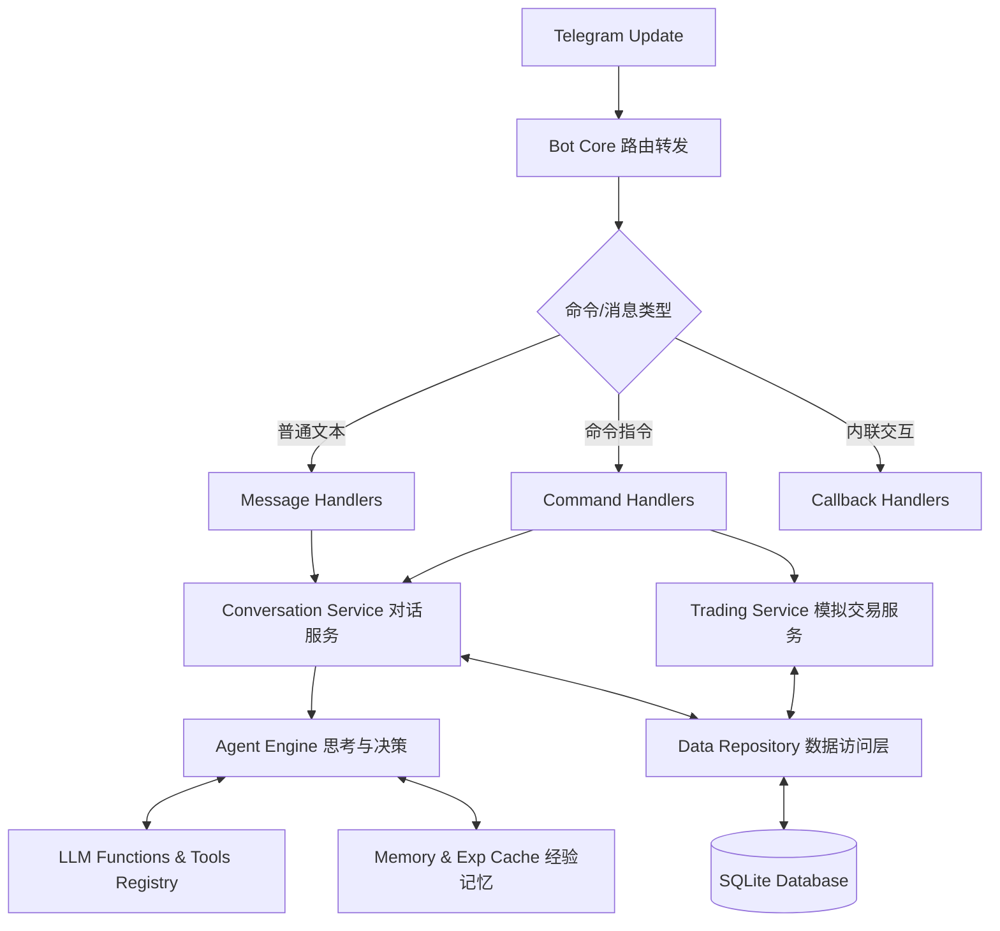
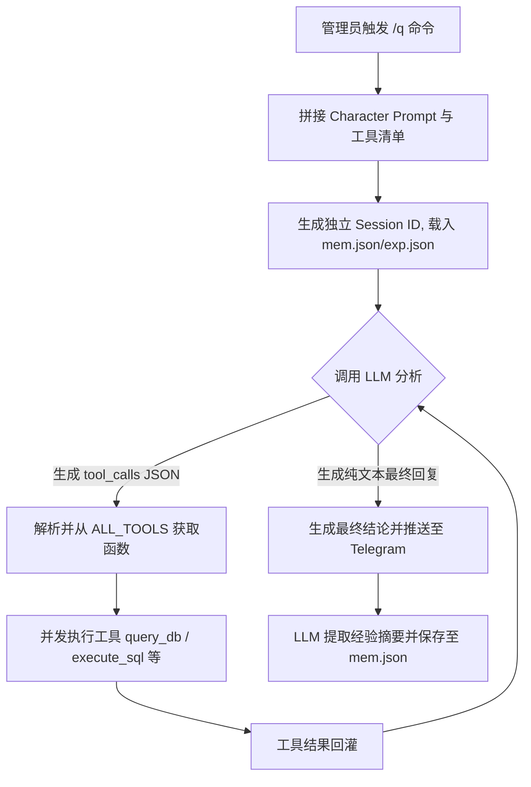

<div align="center">
  <h1>🤖 CyberWaifu Bot</h1>
  <p><strong>基于现代分层架构的多角色 AI 与加密货币交易模拟 Telegram 机器人</strong></p>

  <p>
    <a href="https://t.me/waifucui_bot"></a>
    <a href="https://www.python.org/"></a>
    <a href="https://flask.palletsprojects.com/"></a>
    <a href="https://github.com/ccxt/ccxt"></a>
    <a href="LICENSE"></a>
  </p>
</div>

一个功能强大的 Telegram AI 聊天机器人，集成了大语言模型多角色对话、高度拟真的加密货币模拟盘交易系统、智能群组管理，以及基于 ReAct 模式的数据库分析 Agent 功能。不仅提供极致的用户交互体验，其模块化的底层设计也为二次开发提供了极大的便利。

**测试版机器人体验：** [https://t.me/waifucui_bot](https://t.me/waifucui_bot)

---

## ✨ 核心特性

- **🤖 智能 AI 交互系统**
  - **多角色支持**：支持预设及自定义个性化角色，智能对话上下文管理。
  - **强大的 Agent 引擎**：支持 OpenAI、Claude、Gemini 等主流大模型，提供统一工具注册与调用接口。
- **📈 沉浸式模拟盘交易**
  - **专业交易闭环**：通过 CCXT 接入实时数据，支持市价单/限价单开仓（做多/做空）、设置止盈止损、一键平仓。
  - **数据分析与可视化**：提供实时持仓浮动盈亏计算、历史盈亏折线图生成、资金杠杆动态强平系统。
  - **群组社交玩法**：全球与群组双榜单（盈利/亏损/爆仓次数/老赖榜）、破产救济金与贷款系统。
- **🧠 数据库分析 Agent (ReAct)**
  - 管理员专属 `/q` 分析工具，采用基于提示词驱动的**多轮工具调用循环**。
  - 内置短周期会话记忆（10分钟）与失败经验累积反馈机制，自动修正工具调用 JSON。
- **🌐 现代化 Web 管理后台**
  - 采用 Flask + Blueprint 架构的响应式管理界面，移动端友好。
  - 实时监控数据统计，可视化管理用户、群组权限、对话记录与角色配置。
- **⚙️ 健壮的底层架构**
  - **分层消息处理**：基于 `asyncio` 的高并发支持，精准的私聊/群组命令路由。
  - **数据访问层解耦**：采用“双重仓库架构”（传统Repository与专用细粒度Repository结合），支持 SQLite 连接池与事务安全。

---

## 🏗️ 系统架构图解

### 1. 核心处理流转 (Core Request Flow)



### 2. 数据库分析 Agent 执行循环 (Agent Loop)
以 `/q` 管理员数据库查询命令为例，展示 ReAct 推理循环：



---

## 🚀 快速开始

### 环境要求
- Python 3.12+
- Docker（可选，推荐生产环境）

### 本地开发部署
1. **克隆与安装依赖**
   ```bash
   git clone https://github.com/your-repo/cyberwaifu_bot.git
   cd cyberwaifu_bot
   pip install -r requirements.txt
   ```

2. **配置初始化**
   - 复制 `config/config.json` 为 `config/config_local.json`。
   - 填写您的 Telegram Bot Token（从 `@BotFather` 获取）、LLM API Keys 等敏感信息。
   - 在 `characters/` 目录下可按需添加角色 JSON 设定文件。

3. **启动服务**
   ```bash
   python bot_run.py
   ```
   *应用启动后，将自动预加载命令处理器，启动 Telegram Bot 轮询，并在后台线程拉起 Web 管理界面及交易监控服务。*

### Docker 生产部署
```bash
docker build -t cyber-waifu-bot .
docker run -d --name cyber-waifu-bot \
  -v "${PWD}/config:/app/config" \
  -v "${PWD}/data:/app/data" \
  -v "${PWD}/characters:/app/characters" \
  -v "${PWD}/prompts:/app/prompts" \
  cyber-waifu-bot
```

---

## 📖 完整命令手册

### 📈 模拟盘交易系统 (Trading)
| 命令 | 说明 | 示例用法 |
| --- | --- | --- |
| `/long` | 开多仓 (支持市价/限价/止盈止损) | `/long btc 100` 或 `/long btc 100@90000 tp@95000` |
| `/short` | 开空仓 (支持市价/限价/止盈止损) | `/short eth 100` 或 `/short eth 100@3000 sl@3200` |
| `/close` | 平仓 (支持单币、方向或一键全平) | `/close btc` 或 `/close btc long 50` 或 `/close` |
| `/position` | 查看当前持仓、浮动盈亏与挂单 | `/position` |
| `/tp` / `/sl` | 单独设置/取消指定仓位的止盈或止损 | `/tp btc long 95000` 或 `/sl eth cancel` |
| `/cancel` | 取消指定挂单或全部挂单 | `/cancel <订单ID>` 或 `/cancel all` |
| `/pnl` | 查看盈亏报告并生成收益曲线图 | `/pnl` |
| `/rank` | 查看交易排行榜 (群组/全球) | `/rank` (群组榜) 或 `/rank all` (全球榜) |
| `/loan` / `/repay` | 申请贷款与还款 | `/loan 1000` 或 `/repay 500` |
| `/bill` | 查看贷款账单 | `/bill` |
| `/begging` | 破产后领取救济金重新开始 | `/begging` |

### 👤 私聊与 AI 交互
| 命令 | 说明 |
| --- | --- |
| `/start` / `/help` | 欢迎消息、功能介绍与帮助文档 |
| `/me` | 查看个人信息、等级与使用统计 |
| `/char` / `/newchar` / `/delchar` | 查看、创建或删除自定义角色设定 |
| `/new` / `/save` / `/dialog` / `/undo` | 对话管理：新对话、保存、加载历史与撤销 |

### 👥 群组管理 (需管理员权限)
| 命令 | 说明 |
| --- | --- |
| `/switch` | 切换当前群组的 AI 回复角色 |
| `/rate [0-1]` | 设置机器人主动插话/回复的概率 |
| `/kw` | 管理触发机器人回复的关键词 |
| `/enable` / `/disable` | 启用/禁用群聊话题主动讨论功能 |
| `/remake` | 重置当前群聊对话上下文记忆 |

### 🔐 系统管理员 (Bot Admin)
| 命令 | 说明 |
| --- | --- |
| `/addf [ID/all] [数]` | 为指定用户或全服发放 Token 额度 |
| `/sett [ID] [等级]` | 修改指定用户的权限等级 |
| `/q [自然语言查询]` | 唤醒数据库 Agent 进行复杂的查询与数据分析 |

---

## 🔧 扩展开发指南

本项目采用高内聚、低耦合的分层架构设计，非常适合二次开发。

### 1. 注册新命令
在 `bot_core/command_handlers/` 下新建 Python 文件并继承 `BaseCommand`，系统在启动时会通过 `CommandHandlers.initialize()` 自动扫描并注册：

```python
from bot_core.command_handlers.base import BaseCommand, CommandMeta
from telegram.ext import ContextTypes
from telegram import Update

class MyCommand(BaseCommand):
    meta = CommandMeta(
        name='my_command',
        command_type='private',
        trigger='mycmd',
        menu_text='我的自定义命令',
        show_in_menu=True,
        menu_weight=10
    )

    async def handle(self, update: Update, context: ContextTypes.DEFAULT_TYPE) -> None:
        await update.message.reply_text("Hello from new feature!")
```

### 2. 注入新 LLM 工具 (Agent Tools)
想要让 AI 获得新的能力（如查询天气、联网搜索）？只需两步：
1. 在 `agent/tools.py` 中编写异步或同步的静态方法。
2. 在 `agent/tools_registry.py` 中将其注册进工具池，定义参数的 JSON Schema，LLM 即可在多轮对话中自动识别并调用该工具。

```python
# 示例：agent/tools.py
class WeatherTools:
    @staticmethod
    async def get_weather(city: str) -> dict:
        # 调用外部天气 API
        return {
            "display": f"获取 {city} 的天气成功",
            "llm_feedback": f"The weather in {city} is Sunny, 25°C."
        }
```

---

## 🤝 贡献指南

1. Fork 本项目仓库
2. 创建您的特性分支 (`git checkout -b feature/AmazingFeature`)
3. 提交您的更改 (`git commit -m 'Add some AmazingFeature'`)
4. 推送到分支 (`git push origin feature/AmazingFeature`)
5. 开启一个 Pull Request

*代码规范请遵循 PEP 8，并尽量使用 Python 类型注解 (Type Hints)。*

## ❓ 常见问题 (FAQ)

- **Q: 机器人无法获取币种价格？**
  A: 检查网络是否能正常访问主流交易所（如 Binance, OKX）的 API，必要时请在环境或配置中设置全局代理。
- **Q: 遇到数据库锁定 (Database Locked) 报错？**
  A: 确保使用内置的 `db_utils` 统一获取连接，并发环境已采用连接池管理，一般不会死锁。
- **Q: Docker 容器重启后数据被重置？**
  A: 务必正确挂载 `-v "${PWD}/data:/app/data"` 等目录，实现 SQLite 数据、日志及自定义角色设定的持久化。

---

<div align="center">
  <p>💖 <b>感谢所有贡献者和用户的支持！如果觉得项目对您有帮助，欢迎点亮 Star ⭐</b></p>
  <p>📝 <b>License:</b> <a href="LICENSE">MIT</a> (Copyright (c) 2025 习翠翠)</p>
</div>
