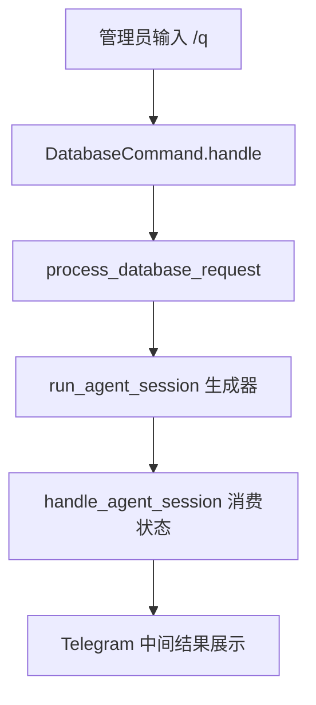

已完成对管理员 [`/q`](bot_core/command_handlers/admin.py:105) 命令的实现级分析。下面按你要求分成 `agent 编排流程`、`工具调用`、`会话管理` 三部分说明，并补上关键文件定位。

## 一、先给结论：`/q` 是一个数据库分析型 agent

管理员命令 [`DatabaseCommand`](bot_core/command_handlers/admin.py:101) 本身很薄，它不直接查库，也不直接执行 SQL，而是做三件事：

1. 解析管理员输入 [`DatabaseCommand.handle()`](bot_core/command_handlers/admin.py:112)
2. 构造一个带数据库工具说明的大 prompt，并启动 [`run_agent_session()`](agent/llm_functions.py:17)
3. 把这个 agent 会话生成器交给 [`handle_agent_session()`](bot_core/services/messages.py:452) 去驱动和回显

所以它的结构是：

- 命令入口层：[`bot_core/command_handlers/admin.py`](bot_core/command_handlers/admin.py)
- agent 核心循环：[`agent/llm_functions.py`](agent/llm_functions.py)
- 工具解析与执行：[`agent/tools_handler.py`](agent/tools_handler.py)、[`agent/tools_registry.py`](agent/tools_registry.py)、[`agent/tools.py`](agent/tools.py)
- Telegram 消息编排：[`bot_core/services/messages.py`](bot_core/services/messages.py)
- 短期 agent 记忆：[`agent/docs/mem.json`](agent/docs/mem.json)、[`agent/docs/exp.json`](agent/docs/exp.json)

注意一点：这个 `/q` 的“会话”不是普通用户私聊会话 [`conversations`](bot_core/data_repository/conversations_repository.py:78) / [`dialogs`](bot_core/data_repository/conversations_repository.py:703) 那套持久会话，而是 **agent 自己的一轮任务会话**，主要通过 [`session_id`](agent/llm_functions.py:25) + 内存文件做短周期记忆管理。

---

## 二、`/q` 的 agent 是怎么编排流程的

### 1. 命令入口只负责启动后台任务

管理员输入 `/q xxx` 后，会进入 [`DatabaseCommand.handle()`](bot_core/command_handlers/admin.py:112)。

关键步骤：

- 校验是否带参数，没有就提示用法 [`admin.py:120`](bot_core/command_handlers/admin.py:120)
- 把参数拼成 `user_input` [`admin.py:126`](bot_core/command_handlers/admin.py:126)
- 用 [`context.application.create_task()`](bot_core/command_handlers/admin.py:129) 把真正处理逻辑放到后台

这意味着 `/q` 不阻塞命令处理线程，而是异步后台执行 agent。

### 2. 后台任务中构造 agent 运行环境

真正逻辑在 [`DatabaseCommand.process_database_request()`](bot_core/command_handlers/admin.py:135)。

它做了几件关键事：

#### 2.1 构造角色提示
[`character_prompt`](bot_core/command_handlers/admin.py:139) 把 agent 定义成“数据库管理助手”，并明确：

- 可以使用提供的工具
- 适合查用户、会话、消息历史
- 对用户、群组、对话记录关键词查询尽量使用模糊匹配

#### 2.2 注入工具+数据库 schema 提示
通过 [`DatabaseSuperToolRegistry.get_prompt_text()`](agent/tools_registry.py:128) 生成很长的系统提示。

这个提示里不只是工具说明，还包括：

- 全量数据库表结构说明，比如 [`conversations`](agent/tools_registry.py:135)、[`dialogs`](agent/tools_registry.py:152)、[`users`](agent/tools_registry.py:226) 等
- 每个工具的参数定义、返回格式、样例 [`tools_registry.py:358`](agent/tools_registry.py:358)
- 使用约束，例如优先参数化查询、查询要加 `LIMIT`、先查用户再深入查记录 [`tools_registry.py:378`](agent/tools_registry.py:378)
- 最重要的是：要求 LLM 如果要调用工具，必须按 JSON 返回，单工具或 `tool_calls` 列表都行 [`tools_registry.py:389`](agent/tools_registry.py:389)

也就是说，**工具选择策略不是硬编码在 Python if/else 里，而是通过 prompt 把工具使用协议教给 LLM。**

#### 2.3 创建 agent 会话 ID
它生成：
[`session_id = f"q_cmd_{update.effective_user.id}_{int(update.message.date.timestamp())}"`](bot_core/command_handlers/admin.py:149)

这说明 `/q` 的一次请求会被当成一个独立 agent session。

#### 2.4 启动 agent 生成器
调用 [`run_agent_session()`](agent/llm_functions.py:17)：

- `user_input` = 管理员原始问题
- `prompt_text` = 工具+schema说明
- `character_prompt` = 数据库助手角色设定
- `llm_api` = 配置项 `q_command_api`，默认 `gemini-2.5` [`admin.py:147`](bot_core/command_handlers/admin.py:147)
- `max_iterations=15` [`admin.py:156`](bot_core/command_handlers/admin.py:156)
- `enable_memory=True` [`admin.py:157`](bot_core/command_handlers/admin.py:157)
- `session_id` = 上面生成的会话 ID

这里返回的不是最终字符串，而是一个 **异步生成器**。

### 3. 消息层负责消费 agent 状态流
[`messages.handle_agent_session()`](bot_core/services/messages.py:452) 会 `async for state in agent_session`，逐步消费 agent 状态。

也就是说整个系统是这种结构：



这里的编排很重要：

- [`run_agent_session()`](agent/llm_functions.py:17) 负责“思考、调工具、继续思考”
- [`handle_agent_session()`](bot_core/services/messages.py:452) 负责“把这些阶段性状态发给 Telegram 用户看”

两者解耦了。

### 4. agent 核心循环是一个多轮 ReAct 风格循环
核心在 [`run_agent_session()`](agent/llm_functions.py:17)。

它的执行模式可以概括为：

1. 初始化 LLM 客户端 [`llm_functions.py:47`](agent/llm_functions.py:47)
2. 如果启用 memory，先加载近期记忆和经验 [`llm_functions.py:54`](agent/llm_functions.py:54)
3. 构造 `system + user` 初始消息 [`llm_functions.py:139`](agent/llm_functions.py:139)
4. 进入最多 15 轮循环 [`llm_functions.py:145`](agent/llm_functions.py:145)
5. 每轮：
   - 发给 LLM 当前消息上下文 [`llm_functions.py:151`](agent/llm_functions.py:151)
   - 获取 LLM 原始回复 [`llm_functions.py:154`](agent/llm_functions.py:154)
   - 用 [`parse_and_invoke_tool()`](agent/tools_handler.py:271) 解析其中是否包含工具调用 [`llm_functions.py:157`](agent/llm_functions.py:157)
6. 若本轮有工具调用：
   - 把工具执行结果 yield 给消息层 [`llm_functions.py:168`](agent/llm_functions.py:168)
   - 再把“工具执行结果”作为新的 user 消息塞回上下文 [`llm_functions.py:188`](agent/llm_functions.py:188)
   - 进入下一轮，让 LLM 基于结果继续分析
7. 若本轮没有工具调用：
   - 视为最终回答 [`llm_functions.py:196`](agent/llm_functions.py:196)
   - yield `final_response`
   - 结束前做 memory summary [`llm_functions.py:200`](agent/llm_functions.py:200)

这就是标准的“LLM 规划 -> 工具执行 -> 结果回灌 -> LLM 再规划 -> 直到停止”的 agent loop。

### 5. 消息层如何展示每一轮
[`handle_agent_session()`](bot_core/services/messages.py:452) 会处理这些状态：

- `initializing`：只记日志，不发消息 [`messages.py:471`](bot_core/services/messages.py:471)
- `thinking`：先回复一个占位消息 `第 N 轮分析中` [`messages.py:475`](bot_core/services/messages.py:475)
- `tool_call`：把这一轮的 LLM 文本和每个工具执行结果渲染成 HTML 发给 Telegram [`messages.py:479`](bot_core/services/messages.py:479)
- `final_response`：输出最终总结 [`messages.py:511`](bot_core/services/messages.py:511)
- `max_iterations_reached`：提示达到上限 [`messages.py:521`](bot_core/services/messages.py:521)
- `error`：输出错误信息 [`messages.py:529`](bot_core/services/messages.py:529)

所以对管理员来说，看到的是“分轮次分析过程”，不是一次性静态回答。

---

## 三、`/q` 里的 agent 怎么调用工具

## 1. 工具不是由命令入口直接调，而是由 LLM 产出 JSON 指令

`/q` 并不会在 [`DatabaseCommand`](bot_core/command_handlers/admin.py:101) 里写死“查 users 表”或“查 dialogs 表”。

真正机制是：

- prompt 把工具清单、参数格式、schema 告诉 LLM [`DatabaseSuperToolRegistry.get_prompt_text()`](agent/tools_registry.py:128)
- LLM 返回 JSON，比如：
  - 单个工具 `{tool_name, parameters}`
  - 或多工具 `{tool_calls: [...]}` [`tools_registry.py:389`](agent/tools_registry.py:389)
- Python 侧再统一解析和执行

所以这是 **LLM 决策，Python 执行** 的模式。

## 2. 可用工具如何注册

数据库工具定义在 [`DATABASE_SUPER_TOOLS`](agent/tools.py:761)，包括：

- [`query_db`](agent/tools.py:586)
- [`revise_db`](agent/tools.py:638)
- [`execute_sql`](agent/tools.py:675)
- [`analyze_group_user_profiles`](agent/tools.py:722)
- [`analyze_database`](agent/tools.py:746)

工具元信息定义在 [`DatabaseSuperToolRegistry.TOOLS`](agent/tools_registry.py:27)。

注册表提供两类东西：

1. `get_tool()` 返回真实 Python 函数 [`tools_registry.py:122`](agent/tools_registry.py:122)
2. `get_prompt_text()` 返回供 LLM 阅读的工具说明 [`tools_registry.py:128`](agent/tools_registry.py:128)

最后这些工具会被汇总进统一工具池 [`ALL_TOOLS`](agent/tools_registry.py:639)，数据库工具是在 [`tools_registry.py:651`](agent/tools_registry.py:651) 加进去的。

## 3. LLM 响应如何被解析成工具调用

这一层在 [`ToolHandler`](agent/tools_handler.py:11)。

入口是 [`parse_and_invoke_tool()`](agent/tools_handler.py:271)，它内部实例化 [`ToolHandler`](agent/tools_handler.py:24) 并调用 [`handle_response()`](agent/tools_handler.py:205)。

解析步骤：

### 3.1 先从 LLM 原始文本里提 JSON
[`ToolHandler._extract_json()`](agent/tools_handler.py:59) 会尝试多种方式：

- 从 ```json 代码块提取 [`tools_handler.py:76`](agent/tools_handler.py:76)
- 从普通文本里匹配 JSON 对象 [`tools_handler.py:89`](agent/tools_handler.py:89)
- 把整段响应当 JSON 试解析 [`tools_handler.py:101`](agent/tools_handler.py:101)
- 如果不完整，尝试修复 JSON [`ToolHandler._attempt_json_repair()`](agent/tools_handler.py:36)

### 3.2 判断是单工具还是多工具
在 [`handle_response()`](agent/tools_handler.py:205)：

- 如果有 `tool_calls`，就按列表执行 [`tools_handler.py:228`](agent/tools_handler.py:228)
- 如果只有 `tool_name`，就包装成单元素列表 [`tools_handler.py:232`](agent/tools_handler.py:232)
- 如果虽然是 JSON 但没有工具字段，就当成普通文本 [`tools_handler.py:235`](agent/tools_handler.py:235)

### 3.3 并发执行工具
有工具后，会构造任务列表：
[`tasks = [self._invoke_tool(call) for call in tool_calls]`](agent/tools_handler.py:244)
然后 [`asyncio.gather()`](agent/tools_handler.py:245) 并发执行。

这点很关键：

- prompt 里要求“顺序执行”多步依赖任务
- 但当前 Python 实现实际是 **同一轮里的多个工具并发跑**

因此如果某两个工具存在强依赖关系，最稳妥的实际行为不是一次回多个 `tool_calls`，而是让 LLM 一轮只调一个，拿到结果后下一轮再调第二个。这是当前实现的一个隐含限制。

## 4. 单个工具如何真正调用

在 [`ToolHandler._invoke_tool()`](agent/tools_handler.py:124)：

1. 取 `tool_name`、`parameters` [`tools_handler.py:134`](agent/tools_handler.py:134)
2. 去 [`ALL_TOOLS`](agent/tools_registry.py:639) 里查真实函数 [`tools_handler.py:146`](agent/tools_handler.py:146)
3. 用 `inspect.signature` 过滤参数，只保留目标函数签名支持的字段 [`tools_handler.py:153`](agent/tools_handler.py:153)
4. 如果是 async 函数就 `await`，否则直接调用 [`tools_handler.py:158`](agent/tools_handler.py:158)
5. 把结果统一规范成：
   - `display`：给管理员展示
   - `llm_feedback`：给下一轮 LLM 继续推理 [`tools_handler.py:163`](agent/tools_handler.py:163)

所以工具层有两个输出通道，这使得：

- 用户看到的结果可以更详细
- LLM 接收到的结果可以更简洁、利于后续推理

## 5. 数据库工具本身干了什么

### 5.1 [`query_db()`](agent/tools.py:586)
只读查询。

- `params` 需要是 JSON 数组字符串，再转 tuple [`tools.py:601`](agent/tools.py:601)
- 调底层 [`db.query_db()`](agent/tools.py:610)
- 返回前 100 行格式化结果 [`tools.py:620`](agent/tools.py:620)

### 5.2 [`revise_db()`](agent/tools.py:638)
执行 INSERT / UPDATE / DELETE。

- 参数也是 JSON 数组字符串 [`tools.py:653`](agent/tools.py:653)
- 调 [`db.revise_db()`](agent/tools.py:662)
- 返回影响行数 [`tools.py:664`](agent/tools.py:664)

### 5.3 [`execute_sql()`](agent/tools.py:675)
高风险兜底工具。

- 直接调 [`db.execute_raw_sql()`](agent/tools.py:686)
- 自动兼容 SELECT / UPDATE / 其他返回类型
- 这是最后手段，不推荐常用

### 5.4 [`analyze_database()`](agent/tools.py:746)
这是一个“数据库查完再让另一个 LLM 帮忙归纳”的二级分析工具。

它会调用 [`agent.llm_functions.analyze_database()`](agent/llm_functions.py:583)：

- 先跑 SQL [`llm_functions.py:595`](agent/llm_functions.py:595)
- 把结果格式化为 JSON 文本 [`llm_functions.py:598`](agent/llm_functions.py:598)
- 再把 `查询结果 + prompts` 发给分析模型 [`llm_functions.py:606`](agent/llm_functions.py:606)

这类工具的价值是：**避免把大量原始查询结果直接塞回主 agent 上下文，减少上下文污染。**

---

## 四、`/q` 里的会话是怎么管理的

这里要分清两套“会话”：

1. 业务对话会话：普通私聊/群聊对话，落库到 [`conversations`](bot_core/data_repository/conversations_repository.py:78)、[`dialogs`](bot_core/data_repository/conversations_repository.py:703) 等
2. `/q` agent 会话：短生命周期的工具推理任务，不落到上述对话表，而是维护在内存消息列表和记忆文件中

`/q` 走的是第 2 套。

## 1. `/q` 的运行时会话上下文在内存里

在 [`run_agent_session()`](agent/llm_functions.py:17) 中，核心上下文变量是 [`current_messages`](agent/llm_functions.py:140)。

初始值：

- `system`：工具说明 + schema + character prompt + memory + experience [`llm_functions.py:139`](agent/llm_functions.py:139)
- `user`：`用户输入: xxx` [`llm_functions.py:142`](agent/llm_functions.py:142)

之后每一轮有工具调用时，会追加：

- assistant 原始回复 [`llm_functions.py:189`](agent/llm_functions.py:189)
- user 角色的“工具调用结果”反馈 [`llm_functions.py:190`](agent/llm_functions.py:190)

这就是 agent 的**主上下文堆栈**。

## 2. `/q` 的 session_id 如何生成和使用

在 [`DatabaseCommand.process_database_request()`](bot_core/command_handlers/admin.py:135) 中生成：

- 格式：`q_cmd_{管理员ID}_{消息时间戳}` [`admin.py:149`](bot_core/command_handlers/admin.py:149)

这个 `session_id` 传给 [`run_agent_session()`](agent/llm_functions.py:17) 后，主要用于记忆系统，而不是数据库对话主键。

## 3. 记忆系统如何加载

因为 `/q` 传了 `enable_memory=True` [`admin.py:157`](bot_core/command_handlers/admin.py:157)，所以 agent 启动时会读：

- [`agent/docs/mem.json`](agent/docs/mem.json)
- [`agent/docs/exp.json`](agent/docs/exp.json)

### 3.1 mem.json：短期会话记忆
在 [`run_agent_session()`](agent/llm_functions.py:54) 中：

- 先加载 [`mem.json`](agent/llm_functions.py:57)
- 清理过期记忆，过期时间 10 分钟 [`llm_functions.py:61`](agent/llm_functions.py:61)
- 如果命中了当前 `session_id`，刷新其过期时间 [`llm_functions.py:69`](agent/llm_functions.py:69)
- 把最近 10 分钟的记忆提炼成 `memory_context` 注入系统提示 [`llm_functions.py:81`](agent/llm_functions.py:81)

注入给主 prompt 的内容包括：

- 历史 session_id
- 用户请求摘要
- 已完成任务
- 重要信息
- 用户偏好
- 待办任务 [`llm_functions.py:103`](agent/llm_functions.py:103)

所以 `/q` 的会话管理本质上是：
**每次新任务启动时，带上过去 10 分钟内相关 agent 任务的摘要记忆。**

### 3.2 exp.json：失败经验库
同样在 [`run_agent_session()`](agent/llm_functions.py:125) 中会读经验库，取最近 5 条 [`llm_functions.py:132`](agent/llm_functions.py:132)，拼进 `experience_context`。

这不是会话上下文本身，而是“执行经验提示”。

## 4. 会话结束时如何总结记忆

如果某轮没有再触发工具，就认为会话正常结束，然后走 [`summarize_memory()`](agent/llm_functions.py:746)。

逻辑：

- 把整个 `conversation_messages` 压缩成一段文本 [`llm_functions.py:803`](agent/llm_functions.py:803)
- 调一个分析 LLM 生成结构化 JSON 总结 [`llm_functions.py:818`](agent/llm_functions.py:818)
- 保存到 [`mem.json`](agent/llm_functions.py:869)

保存的条目结构大致是：

- `timestamp`
- `last_updated`
- `expires_at`
- `summary`
- `conversation_length` [`llm_functions.py:841`](agent/llm_functions.py:841)

其中 `summary` 内又有：

- `session_summary`
- `cached_data`
- `insights` [`llm_functions.py:781`](agent/llm_functions.py:781)

## 5. 异常或达到最大轮次时如何处理会话

### 5.1 达到上限
如果超过 [`max_iterations`](agent/llm_functions.py:23)，会 yield [`max_iterations_reached`](agent/llm_functions.py:220)，并且：

- 做失败模式分析 [`llm_functions.py:223`](agent/llm_functions.py:223)
- 同时做 memory summary [`llm_functions.py:229`](agent/llm_functions.py:229)

### 5.2 工具调用报错
如果工具结果里出现 `error/failed/exception`，会判定有工具错误 [`llm_functions.py:160`](agent/llm_functions.py:160)，并调用 [`analyze_failure_patterns()`](agent/llm_functions.py:625) 生成经验写入 [`exp.json`](agent/llm_functions.py:720)

### 5.3 运行异常
外层异常会 yield [`error`](agent/llm_functions.py:253)，同时也会尝试失败分析和记忆总结 [`llm_functions.py:239`](agent/llm_functions.py:239)

所以 `/q` 的会话不是“崩了就丢”，而是会：

- 记失败经验到 [`exp.json`](agent/docs/exp.json)
- 记会话摘要到 [`mem.json`](agent/docs/mem.json)

---

## 五、这个 `/q` 会不会写入普通对话数据库

从目前代码看，**不会走普通私聊对话那套持久化链路**。

普通私聊会话的存储链路在：

- [`PrivateConv`](bot_core/services/conversation.py:289)
- [`ConversationService.save_turn()`](bot_core/services/conversation.py:615)
- [`ConversationRepository.add_message()`](bot_core/data_repository/conv_repo.py:233)
- [`ConversationsRepository.dialog_content_add()`](bot_core/data_repository/conversations_repository.py:673)

而 `/q` 完全没有实例化 [`PrivateConv`](bot_core/services/conversation.py:289) 或 [`ConversationService`](bot_core/services/conversation.py:520)，只走：

- [`run_agent_session()`](agent/llm_functions.py:17)
- [`handle_agent_session()`](bot_core/services/messages.py:452)

因此 `/q` 自己不把消息写到 [`conversations`](bot_core/data_repository/conversations_repository.py:50) / [`dialogs`](bot_core/data_repository/conversations_repository.py:673)。

但要注意：

- `/q` 调用的数据库工具本身当然可以查询这些表
- 甚至可以通过 [`revise_db`](agent/tools.py:638) 或 [`execute_sql`](agent/tools.py:675) 修改业务数据
- `/q` 自身的“会话历史”只存在于 `current_messages` 与 [`mem.json`](agent/docs/mem.json) 的短期摘要里

---

## 六、把整个 `/q` 过程串成一条完整链路

可以把 `/q` 的完整执行链总结成下面这条：

```mermaid
flowchart TD
    A[管理员输入问题] --> B[/q 命令入口]
    B --> C[拼接 character_prompt 与工具提示]
    C --> D[生成 session_id]
    D --> E[run_agent_session]
    E --> F[加载 mem.json 与 exp.json]
    F --> G[调用 LLM]
    G --> H{是否输出工具调用 JSON}
    H -- 是 --> I[parse_and_invoke_tool]
    I --> J[从 ALL_TOOLS 找到工具]
    J --> K[执行 query_db revise_db execute_sql 等]
    K --> L[工具结果回灌给 LLM]
    L --> G
    H -- 否 --> M[输出最终回复]
    M --> N[总结记忆写入 mem.json]
```

---

## 七、实现上的几个关键特点与隐含设计

## 1. 它是“提示驱动型 agent”，不是框架型 agent

这里没有 LangChain / AutoGen 之类的外部 agent 框架。

整个 `/q` agent 是项目自己手写的最小闭环：

- prompt 里告诉 LLM 可用工具和协议 [`tools_registry.py:128`](agent/tools_registry.py:128)
- [`run_agent_session()`](agent/llm_functions.py:17) 手动迭代
- [`parse_and_invoke_tool()`](agent/tools_handler.py:271) 手动解析工具 JSON
- 手动回灌工具结果给 LLM [`llm_functions.py:190`](agent/llm_functions.py:190)

这是一种很轻量、可控的实现。

## 2. `/q` 的记忆是“任务记忆”，不是“用户长期对话记忆”

普通聊天会话靠数据库表持久化，`/q` 靠 [`mem.json`](agent/docs/mem.json) 做 10 分钟 TTL 的摘要记忆。

所以它更像：

- 短期任务上下文续接
- 失败经验积累
- 临时执行缓存

而不是完整聊天历史归档。

## 3. 工具调用协议做了较强容错

[`ToolHandler._extract_json()`](agent/tools_handler.py:59) 和 [`_attempt_json_repair()`](agent/tools_handler.py:36) 做了不少容错，说明作者已经预期 LLM 常常输出“半结构化 JSON + 解释文本”。

## 4. 多工具并发执行与 prompt 里的顺序依赖存在张力

这是当前设计里最值得注意的一点：

- prompt 鼓励在多步骤任务时输出 `tool_calls` 列表 [`tools_registry.py:389`](agent/tools_registry.py:389)
- 但执行器用 [`asyncio.gather()`](agent/tools_handler.py:245) 并发跑

所以严格依赖上一步结果的多步工作流，实际上更适合：

- 一轮一个工具
- 下一轮再基于结果调下一个工具

否则会有顺序依赖被打破的问题。

---

## 八、关键文件清单

你后续如果要继续深挖，我建议优先看这些文件：

- 命令入口：[`bot_core/command_handlers/admin.py`](bot_core/command_handlers/admin.py)
- agent 主循环：[`agent/llm_functions.py`](agent/llm_functions.py)
- 工具解析器：[`agent/tools_handler.py`](agent/tools_handler.py)
- 工具注册表：[`agent/tools_registry.py`](agent/tools_registry.py)
- 数据库工具实现：[`agent/tools.py`](agent/tools.py)
- Telegram 状态回显：[`bot_core/services/messages.py`](bot_core/services/messages.py)
- 普通业务对话持久化对照：[`bot_core/services/conversation.py`](bot_core/services/conversation.py)、[`bot_core/data_repository/conversations_repository.py`](bot_core/data_repository/conversations_repository.py)
- agent 短期记忆文件：[`agent/docs/mem.json`](agent/docs/mem.json)
- agent 失败经验文件：[`agent/docs/exp.json`](agent/docs/exp.json)

## 九、最终总结

一句话总结：

管理员 [`/q`](bot_core/command_handlers/admin.py:105) 命令的 agent，是一个 **基于 prompt 驱动的多轮工具调用循环**。

- **流程编排**：由 [`run_agent_session()`](agent/llm_functions.py:17) 控制，采用 `LLM -> 解析工具调用 -> 执行工具 -> 结果回灌 -> 再推理` 的循环
- **工具调用**：由 [`DatabaseSuperToolRegistry`](agent/tools_registry.py:24) 暴露工具协议，由 [`ToolHandler`](agent/tools_handler.py:11) 从 LLM 输出中抽取 JSON，再通过 [`ALL_TOOLS`](agent/tools_registry.py:639) 路由到真实函数
- **会话管理**：不走普通聊天数据库会话，而是使用 [`session_id`](bot_core/command_handlers/admin.py:149) 配合 [`mem.json`](agent/docs/mem.json) 做 10 分钟短期记忆，配合 [`exp.json`](agent/docs/exp.json) 累积失败经验

当前已经形成可执行的分析结论。如果你对这个解释满意，下一步最适合切到 `ask` 模式，我再把这套流程整理成“更像时序图的逐调用解释版”；如果你想改实现，则切到 `code` 模式最合适。